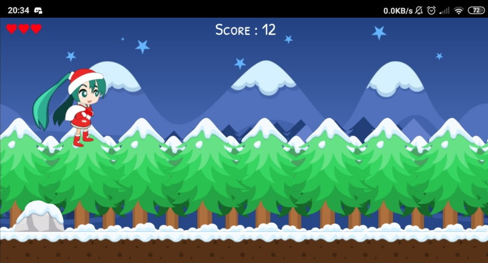

# VocaloidWinterGame
Secret Santa gift for [@miraigirl](https://www.instagram.com/miraigirl01/) [#vocaloidSecretSanta2019](https://www.instagram.com/explore/tags/vocaloidsecretsanta2019)  

Game created with Lua using the [Love2D framework](https://love2d.org/)

<p align="center">
    
</p>

## How to play

### Controls

* Jump : Space / Right click
* Pause : P key
* Quit : Escape

### Entities

|                                       Sprite                                       |                     Entity                     |
|:----------------------------------------------------------------------------------:|:----------------------------------------------:|
|       |             **Stone**<br>Remove 1 ❤️            |
|   |   **Crystal**<br>Same as a stone but smaller   |
|   | <br>**Snowman**<br>Same as a stone but can fly |
| |       <br>**Ice Block**<br>Incease speed       |
|   |          <br>**Heal Block**<br>Add 1 ❤️         |

## Builds

* Windows (.exe) : [https://logantann.github.io/vocaloidWinterGame/build/vocaWinterGame_w32.zip](https://logantann.github.io/vocaloidWinterGame/build/vocaWinterGame_w32.zip)
* GameFile : [logantann.github.io/vocaloidWinterGame/dist/vocaloidWinterGame.love](https://logantann.github.io/vocaloidWinterGame/dist/vocaloidWinterGame.love)
* Linux/MAC/Android : See instructions of section [Run the Source or GameFile](#Run-the-Source-or-GameFile)

## Run the Source or GameFile

### PC / MAC:

1.	Download the love2D Binary (Zipped version or AppImage for Linux) at [love2d.org](https://love2d.org/)
2.	[Download the gameFile](https://logantann.github.io/vocaloidWinterGame/dist/vocaloidWinterGame.love), then drag and drop it to the love binary  
	Or using the console :
	```
	love [arg]
	```
	Where arg is the `.love` gameFile or the `src/` folder

### Android :

1. Download [Love2D app on the PlayStore](https://play.google.com/store/apps/details?id=org.love2d.android)
2. [Download and open the `.love` GameFile](https://logantann.github.io/vocaloidWinterGame/dist/vocaloidWinterGame.love) with love2D using your browser

<p align="center">
    
</p>

### Create a gameFile or make a build

Check this tutorial : [love2d.org/wiki/Game_Distribution](https://love2d.org/wiki/Game_Distribution)

## Credits

Programming : Me, using Love2D game library

Art :
* Miku sprite : Me
* [Winter Tileset](https://www.gameart2d.com/winter-platformer-game-tileset.html) + some edits by me

Sound :
* [BGM : Padoru Padoru - Hatsune Miku VOCALOID COVER](https://www.youtube.com/watch?v=-rZp4kMSjzQ)
* [Jumping sound by dklon](https://opengameart.org/content/platformer-jumping-sounds)
